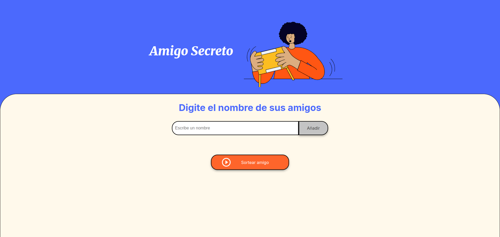
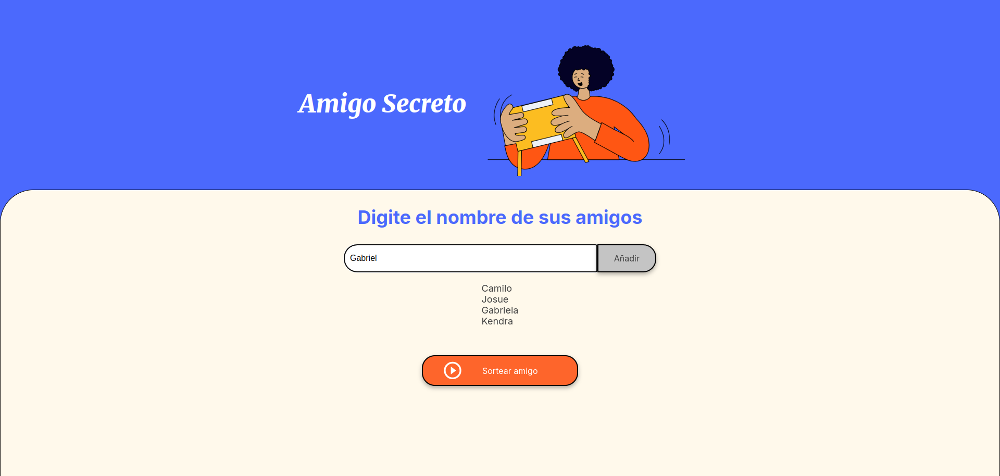
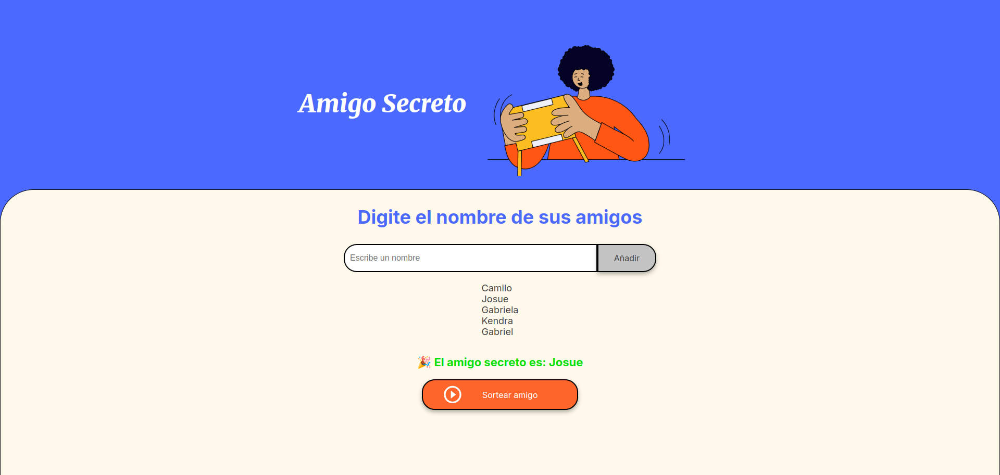

# Challenge Amigo Secreto

  

## Descripción
Esta aplicación web permite a los usuarios ingresar nombres de amigos y realizar un sorteo aleatorio para determinar quién es el "Amigo Secreto". Es ideal para organizar juegos de Amigo Secreto en reuniones, fiestas o eventos. La interfaz es simple, interactiva y fácil de usar, lo que garantiza una experiencia fluida para todos los usuarios.

> **Nota:** Esta aplicación no requiere conexión a internet ni dependencias externas, lo que la hace ligera y accesible desde cualquier navegador moderno.

## Características Principales
- **Agregar nombres:** Los usuarios pueden ingresar nombres de amigos en un campo de texto y añadirlos a una lista visible.
- **Validación de datos:** Se asegura de que no se ingresen nombres vacíos o inválidos. Si el campo está vacío, se muestra una alerta de error.
- **Sorteo aleatorio:** Al hacer clic en el botón "Sortear Amigo", se selecciona un nombre aleatorio de la lista y se muestra en pantalla.
- **Interfaz amigable:** Diseño limpio, responsivo y adaptable para proporcionar una experiencia de usuario óptima en dispositivos de diferentes tamaños.

## Capturas de Pantalla

A continuación, se muestran ejemplos de cómo funciona la aplicación:

### 1. Interfaz Principal
  
*(Página principal con el campo de texto y el botón "Añadir".)*

### 2. Lista de Amigos
  
*(Lista de amigos agregados.)*

### 3. Resultado del Sorteo
  
*(Resultado del sorteo con el nombre del amigo secreto seleccionado.)*

## Instalación
Para ejecutar este proyecto localmente, sigue estos pasos:

1. **Clona el repositorio:**
   ```bash
   git clone https://github.com/jsan2321/challenge-amigo-secreto.git
   ```

2. **Abre el proyecto:**
   - Navega a la carpeta del proyecto:
     ```bash
     cd challenge-amigo-secreto
     ```
   - Abre el archivo `index.html` en tu navegador favorito:
     ```bash
     open index.html
     ```
   - Opcionalmente, usa una extensión como **Live Server** en Visual Studio Code para ejecutar el proyecto en un servidor local.

## Extensiones Recomendadas
- **Live Server:** Una extensión de Visual Studio Code que permite ejecutar un servidor local y recargar automáticamente la página cuando se realizan cambios en el código.  
    
  [Descargar Live Server](https://marketplace.visualstudio.com/items?itemName=ritwickdey.LiveServer)

## Funcionalidades Detalladas
1. **Agregar nombres:**
   - Escribe el nombre de un amigo en el campo de texto.
   - Haz clic en el botón "Añadir" para agregarlo a la lista.
   - Si intentas agregar un nombre vacío, aparecerá una alerta pidiendo un nombre válido.

2. **Ver la lista de amigos:**
   - Los nombres agregados se muestran en una lista debajo del campo de entrada.

3. **Sortear amigo:**
   - Haz clic en el botón "Sortear Amigo".
   - La aplicación seleccionará aleatoriamente un nombre de la lista y lo mostrará en pantalla.